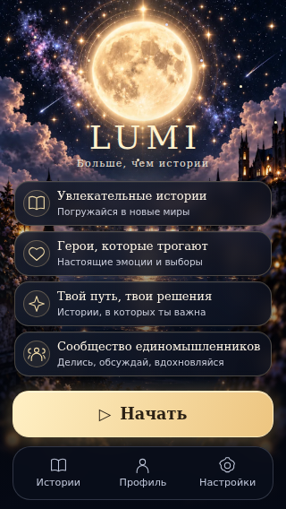

# LUMI home — visual and functional QA, 2026-10-03

Base HEAD: `539d7e4fa76d91f8ce01bb080c1e4b96283991de`.
Existing branch `feat/prototype-0.1`, existing PR #1.

## Audit and correction

The original 320px screen placed LUMI over the moon and hid all feature descriptions. The 360px screen had a large gap before the CTA, while at 390px the fourth card touched it. Several successive home implementations overrode each other in global.css. Session settings reset when the menu unmounted and the haptics toggle did not affect story impacts.

- Retained the exact approved versioned local artwork through publicAsset. No artwork regeneration, external CDN, or content changes.
- Consolidated the home/library/profile/settings CSS into one block. Removed obsolete CSS moons, horizons, animated filters, duplicate keyframes and overrides. Unrelated story/chat/recap rules are unchanged.
- Kept the moon unobstructed at the initial scroll position; separated the serif brand, skyline and equal-height glass cards. All four descriptions remain present. Removed arrows from non-interactive feature cards and replaced font-dependent symbols with small SVG icons.
- CTA is at least 52px. The three equal navigation targets are at least 48px high. They occupy separate flex rows and remain available while the content scrolls. Active and keyboard-focus states are visible.
- Added return-to-home controls on every tab. Catalog callbacks use exact story IDs and reject unavailable items. Profile data and access labels continue to use existing inputs.
- Motion and haptics survive menu/season/story remounts in the session. Storage-denial and write-only failures use an in-memory fallback. Disabling motion removes every home animation, including pseudo-elements, without changing geometry. System reduced motion also stops them. The haptics preference gates the existing StoryScreen impact only.
- Existing ready/expand/optional requestFullscreen adapter and initData handling were retained. Existing tests cover absent and throwing fullscreen methods.

## Verification

| Check | Result |
|---|---|
| Frontend unit tests | 205 passed, 30 files |
| Typecheck | Passed |
| Five story graph validators | Passed: Last Online E1–E4 and Black Roses E1 |
| Pages production build | Passed; existing bundle-size advisory remains |
| Backend Deno tests | 30 passed |
| Full local Playwright run | 56 passed before final review edge fixes |
| Final home regression run | 12 passed, including new collapsed-height regression; final suite now has 57 tests |
| Independent read-only review | Approved after storage, short-height and keyboard-focus fixes |
| Diff scope / whitespace | Checked |

The existing CI and Pages workflows run the full suite again for the pushed commit. Their run URLs and final hosted verification are reported with the release.

Publication recheck: 205 unit tests, typecheck, all five graph validators, 30 Deno tests and the Pages build passed again. The focused home/profile resume and both-story navigation browser scenario also passed. The full repeat in the restricted execution environment was interrupted: regular Chrome cannot create its process-singleton socket, and the single-process fallback exits when separate browser contexts close. The complete 57-test suite remains a required GitHub CI gate before Pages deploy; no application or test assertions were changed to work around the local browser restriction.

Covered home Start/Continue; Stories/Profile/Settings and home return; profile continue into saved E2; both catalog SeasonScreens and round trip; no progress writes during navigation; disabled catalog entries; motion off/on, remount, reload and system reduced motion; haptics off/on; overflow and target dimensions.

## Visual QA

Reviewed final screenshots at 320×568, 360×740, 390×844 and 430×932, also with Telegram top 24 + content top 32 and bottom 34px insets. All normal viewports show the full feature list, CTA and navigation without horizontal overflow. At 320×568 with those additional 90px of Telegram insets the content uses vertical scrolling; CTA and navigation stay visible. A separate regression simulates a 340px stable Telegram viewport and checks keyboard scrolling and no CTA/nav overlap.

| 320×568 | 360×740 |
|---|---|
|  |  |

| 390×844 | 430×932 |
|---|---|
|  |  |

Additional tab, safe-area and scrolled screenshots are produced under `docs/visual-qa/screenshots/home` and retained in the workflow visual QA artifact.

## Build fingerprints

- JS `index-BbrmzG_-.js`: `3d1d88f38488a39893cf7b2f99ba6f95565f672175f0c6afd1029a89bac49543`
- CSS `index-CgqgHLhe.css`: `490a96b8a98fc687df7013476e13b8a4ec50c65c6cae7a3fdf6c6e81ac06d267`
- Unchanged `lumi-home-bg-v2.webp`: `c0d8c0a820157dd2bbdcdadd5131254a816c8cca4489af4727692cb757fad764`

Browser scenarios use a Telegram fixture and intercepted API storage. They do not claim a physical iPhone/Telegram session, real Telegram haptic output or authenticated production saves. Backend, authentication, payments, story graphs, progress machine and production user data were not modified.
